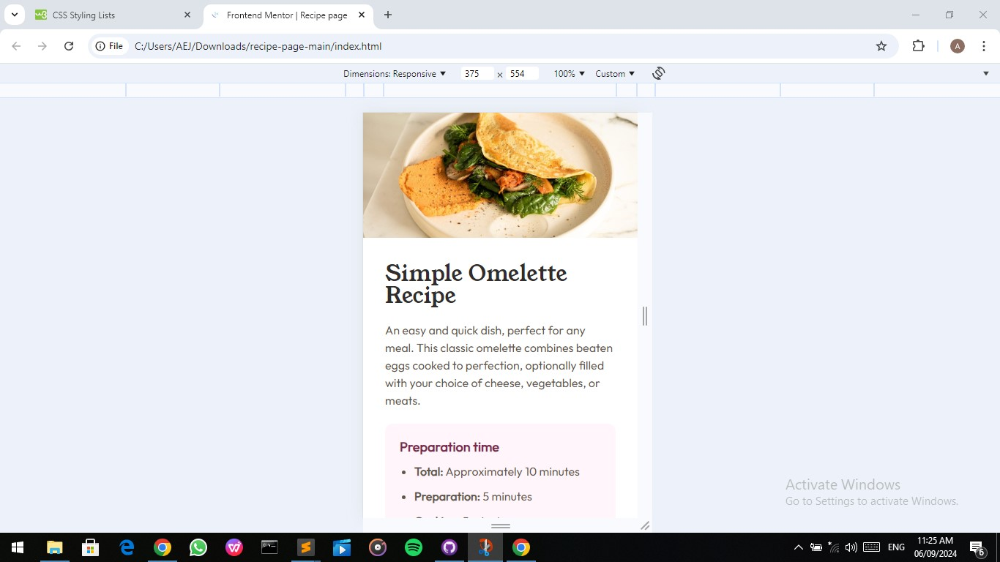
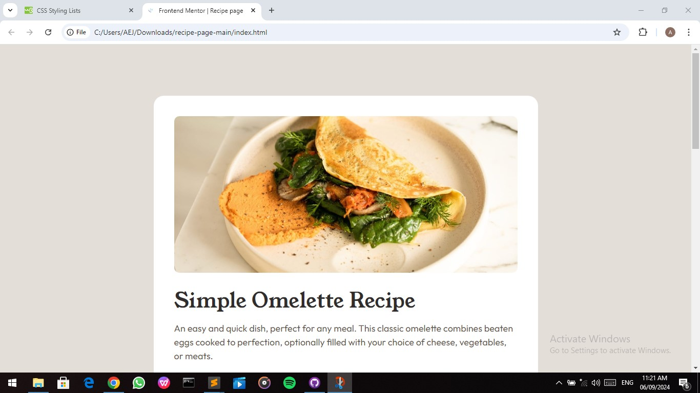

# Frontend Mentor - Recipe page solution

This is a solution to the [Recipe page challenge on Frontend Mentor](https://www.frontendmentor.io/challenges/recipe-page-KiTsR8QQKm).

## Table of contents

- [Overview](#overview)
  - [The challenge](#the-challenge)
  - [Screenshot](#screenshot)
  - [Links](#links)
- [My process](#my-process)
  - [Built with](#built-with)
  - [What I learned](#what-i-learned)
  - [Continued development](#continued-development)
  - [Useful resources](#useful-resources)
- [Author](#author)
- [Acknowledgments](#acknowledgments)


## Overview

### Screenshot




### Links

- Solution URL: (https://github.com/Abas-code/recipe-page-main)
- Live Site URL: (https://recipe-page-main-mauve-three.vercel.app/)

## My process

### Built with

- Semantic HTML5 markup
- CSS custom properties
- Flexbox
- CSS Grid
- Mobile-first workflow

### What I learned

I learnt how to use CSS Grid to a table.

```html
<div class="table">
  <div class="item">Calories</div>
  <div class="item brown">277kcal</div>
  <div class="item">Carbs</div>  
  <div class="item brown">0g</div>
  <div class="item">Protein</div>
  <div class="item brown">20g</div>  
  <div class="item none">Fat</div>
  <div class="item brown none">22g</div>
</div>
```
```css
.table { display: grid; grid-template-columns: auto auto; }
.item {
  border-bottom: 1px solid var(--stone-150);
  padding: 10px 30px;
  text-align: left;
}
```

### Continued development

I will continue to learn how to CSS Grid more efficiently.

### Useful resources

- [W3Schools](https://www.w3schools.com)


## Author

- Frontend Mentor - [@Abascode](https://www.frontendmentor.io/profile/Abascode)


## Acknowledgments

I want to thank those who have been suggesting effective ways of achieving better page layouts. 